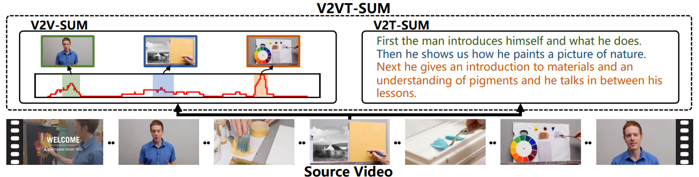
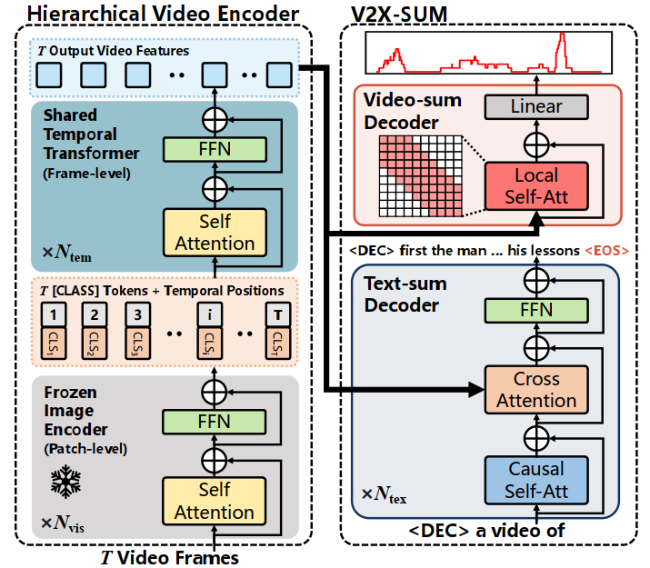

# VideoXum: Cross-modal Visual and Textural Summarization of Videos

[Paper link](https://arxiv.org/pdf/2303.12060)

## Quick Summary
This paper introduces a novel task of cross-modal video summarization, along with a new large-scale dataset called VideoXum. The authors propose VTSUM-BLIP, an end-to-end framework for generating both **visual and textual summaries** from long videos, and introduce VT-CLIPScore for evaluating semantic consistency between the two modalities.

## Key Points
- Introduces cross-modal video summarization task (V2X-SUM)
- Creates VideoXum, a large-scale dataset with 14K videos and 140K summary pairs
- Proposes VTSUM-BLIP, an end-to-end framework for cross-modal summarization
- Develops VT-CLIPScore for evaluating semantic consistency
- Achieves state-of-the-art results on VideoXum and existing benchmarks

## Problem Statement
Existing methods treat visual and textual summarization as separate tasks, neglecting the semantic correlation between them. This paper aims to bridge this gap by introducing a unified approach for generating both visual and textual summaries with semantic coherence.

## Dataset: VideoXum
- Size: 14,001 long videos with 140,010 video and text summary pairs
- Source: Built upon ActivityNet Captions dataset
- Unique features: 
  - Open-domain videos covering 200 distinct activity categories
  - Average video length: 124.2 seconds
  - Average video summary compression ratio: 13.6%
  - Text summaries average 49.9 words in length

## Methodology
### VTSUM-BLIP Framework

Key Components:
1. BLIP Encoder: A pretrained vision-language model used for image feature extraction.
2. Temporal Transformer (TT): Processes sequential data to capture temporal relationships.
3. Context Aggregation (CA): Enhances local context information for video representations.
4. Video-Sum Decoder: Generates video summaries by selecting important frames.
5. Text-Sum Decoder: Generates textual summaries of video content.

Methodology Flow:

1. Video Frame Processing:
   - Input video frames are passed through the frozen BLIP encoder for feature extraction.
   - This produces a sequence of visual tokens for each frame.

2. Temporal Modeling:
   - The visual tokens are combined with temporal position embeddings.
   - This combined input is fed into the Temporal Transformer (TT) to model temporal relationships.
   - The TT has 1 layer and produces spatiotemporal visual features.

3. Video Summarization:
   - The spatiotemporal features are input to the Video-Sum Decoder.
   - A Context Aggregation (CA) module with a window size of 5 captures local context.
   - A binary classifier predicts frame-level importance scores.
   - The top 15% of frames based on these scores are selected for the video summary.

4. Text Summarization:
   - The spatiotemporal features are also input to the Text-Sum Decoder.
   - This decoder is a 12-layer Transformer with causal self-attention.
   - It takes a prompt sequence (e.g., "[DEC] a video of") along with the video features.
   - The decoder generates a textual summary of the video content.

5. Training:
   - The model is trained end-to-end for 56 epochs using AdamW optimizer.
   - A multi-task loss combines binary cross-entropy for video summarization and negative log-likelihood for text summarization.
   - The loss weights are set to 15.0 for video summarization and 1.0 for text summarization.

## Experiments
### Datasets
- VideoXum
- TVSum, SumMe, ActivityNet Captions (for comparison)

### Evaluation Metrics
- V2V-SUM: F1 score, Kendall's τ, Spearman's ρ
- V2T-SUM: BLEU@4, METEOR, ROUGE-L, CIDEr
- V2VT-SUM: VT-CLIPScore

### Results
- VideoXum:
  - V2V-SUM: F1 score of 23.5%, Kendall's τ of 0.196, Spearman's ρ of 0.258
  - V2T-SUM: BLEU@4 of 5.8%, METEOR of 12.2%, ROUGE-L of 25.1%, CIDEr of 23.1%
  - V2VT-SUM: VT-CLIPScore of 29.4%
- Outperforms existing methods on TVSum, SumMe, and ActivityNet Captions

## Key Findings
- VTSUM-BLIP achieves promising results on VideoXum and outperforms existing methods on single-modal benchmarks
- Temporal Transformer and Context Aggregation modules improve performance
- VT-CLIPScore shows high consistency with human evaluation for measuring semantic coherence

## Future Work
- Explore more advanced strategies for associating V2V and V2T summarization tasks
- Expand the dataset using large language models like GPT-4
- Develop more reliable metrics for video-text coherence measurement
- Integrate advanced visual/video encoders and large language models into the framework
- Investigate the use of the proposed framework for developing general-purpose video assistants

## Personal Notes
This paper presents a significant advancement in video summarization by introducing a cross-modal approach. The VideoXum dataset and VTSUM-BLIP framework provide a strong foundation for future research in this area. The proposed VT-CLIPScore metric addresses a crucial gap in evaluating cross-modal consistency. This work has potential applications in video content analysis, retrieval, and accessibility.
